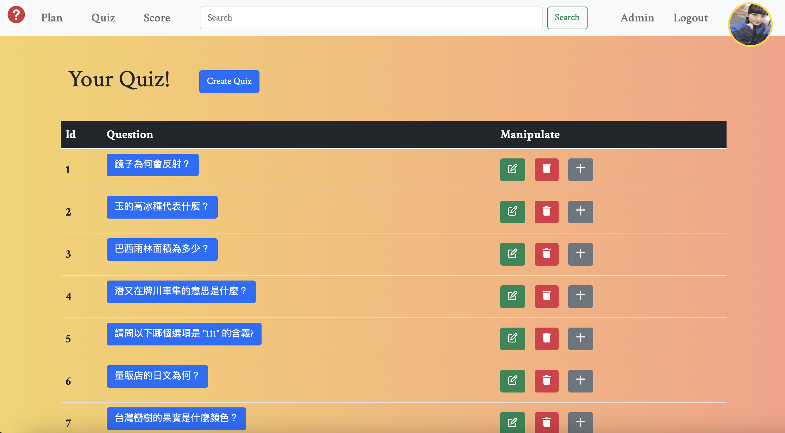
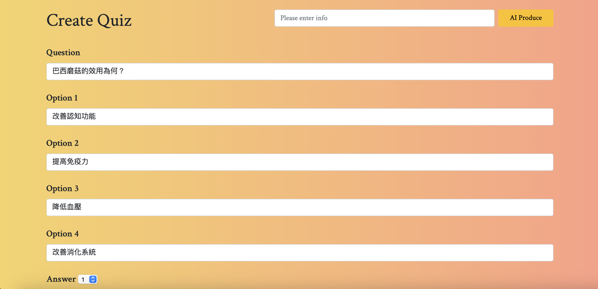
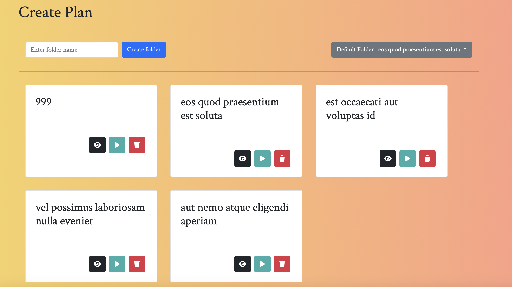
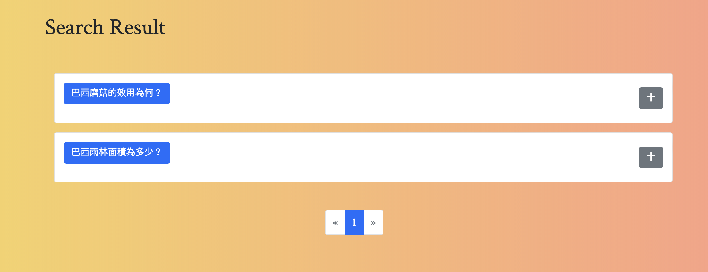
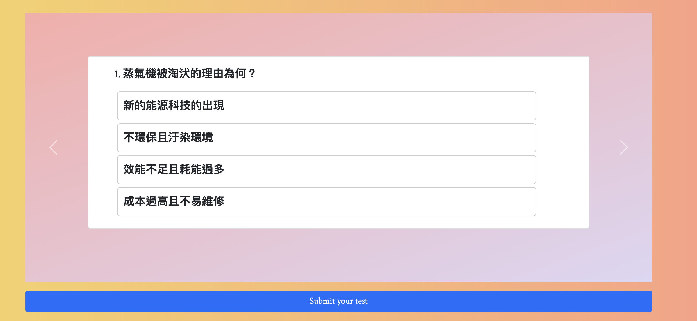
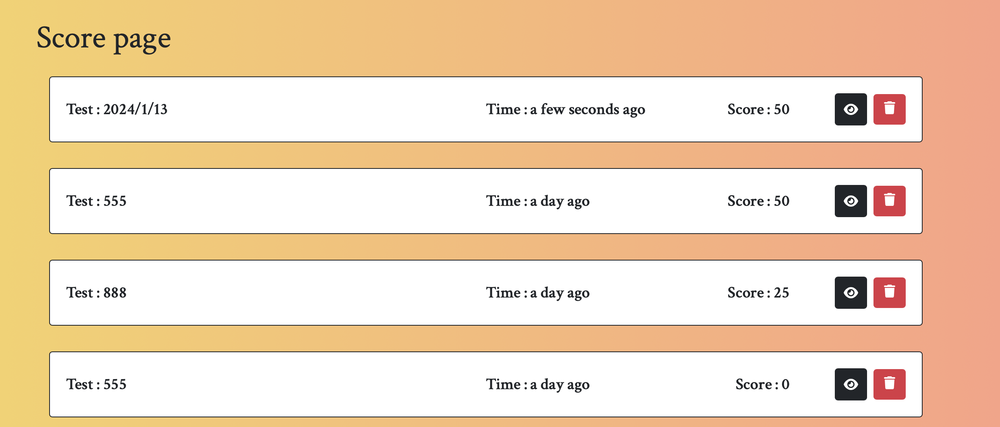

# Quiz_App
針對學習計畫來製作題目來幫助練習，可以生成學習計畫，也能夠模擬測驗並獲得測驗分數

## 功能
可使用Facebook, Google登入

可以建立自己的Quiz


做用AI來生成題目


建立自己的學習計畫


搜尋其他人的題目來協助建立你的學習計畫


模擬試驗


確認自己的學習成果



## 使用之前...
請先確認有安裝node.js及npm

## 複製專案
1. Fork
2. git clone

## 初始化
```
npm install // 安裝套件
```

## 設定資料庫
需要與 config/config.js 一致

## 設定環境變數
請參照.env.example進行設置

## 將model寫入資料庫
```
npm run migrate
```

## 寫入種子資料
```
npm run seed
```

## 啟動程式
```
npm run dev
```

## 若看見此行訊息則代表順利運行，打開瀏覽器進入到以下網址

```
App is now listening on port 3000
```

請至 http://localhost:3000 開啟網站

## 若欲中斷伺服器連線，請按

   ```
ctrl + c
```

# 開發工具
- Node.js 18.16.0
- Express 4.18.2
- Express-Handlebars 5.0.0
- Method-override 3.0.0
- pg 8.11.3,
- sequelize 6.35.2,
- sequelize-cli 6.6.2
- Bcryptjs 2.4.3
- connect-flash 0.1.1
- Express-session 1.17.3
- passport 0.7.0
- passport-local 1.0.0
- passport-facebook 3.0.0
- passport-google-oauth20 2.0.0
- passport-jwt 4.0.0
- jsonwebtoken 8.5.1
- multer 1.4.5-lts.1
- imgur 1.0.2
- express-rate-limit 7.1.5
- express-async-errors 3.1.1
- http-status-codes 2.3.0
- helmet 7.1.0
- cors 2.8.5
- xss-clean 0.1.4
- express-rate-limit 7.1.5
- faker 5.5.3
- openai 4.24.4